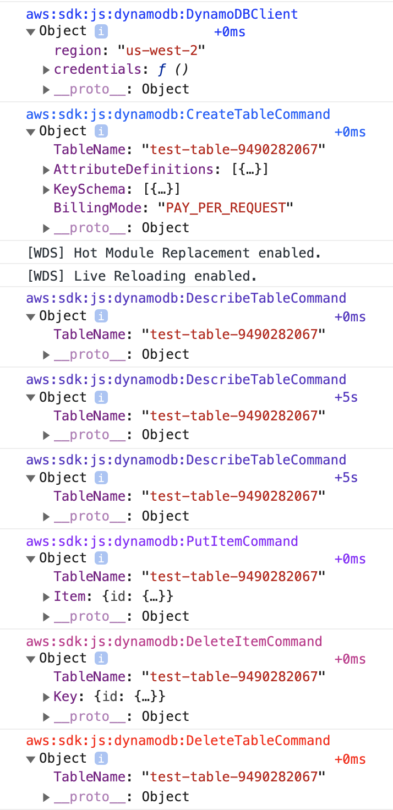

## Steps to follow

- [Create a Amazon Cognito Identity pool for testing](https://docs.aws.amazon.com/sdk-for-javascript/v2/developer-guide/getting-started-browser.html#getting-started-browser-create-identity-pool)
- Update this `IDENTITY_POOL_ID` in [src/index.js](./src/index.js)
- Run `yarn start:browser` which opens the code in browser
- Set `localStorage.debug = "aws:*"` in Browser Console
- Edit index.js and save, which will reload the tab with debug logs in tab

  

  
Screenshot

  

  

