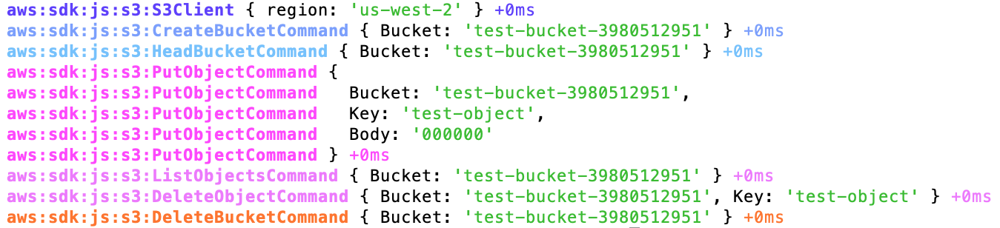
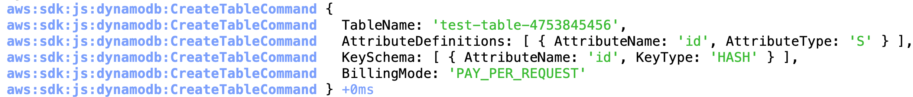

## Steps to follow

- [Configure your AWS credentials for Node.js](https://docs.aws.amazon.com/sdk-for-javascript/v2/developer-guide/setting-credentials-node.html)
- Run `DEBUG=aws:* node index.js` to log all debug statements

  <details>
  <summary>Screenshot</summary>

  

  </details>

- Run `DEBUG=aws:sdk:js:dynamodb:CreateTableCommand node index.js` to log debug statements in CreateTableCommand

  <details>
  <summary>Screenshot</summary>

  

  </details>

- Get detailed output in ndjson format by [preloading pino-debug](https://github.com/pinojs/pino-debug#preload) while running the command

  <details>
  <summary>Output</summary>

  ```console
  $ DEBUG=aws:* node -r pino-debug index.js
  {"level":20,"time":1586410354379,"pid":65184,"hostname":"186590ce2139","ns":"aws:sdk:js:dynamodb:DynamoDBClient","region":"us-west-2","v":1}
  {"level":20,"time":1586410354381,"pid":65184,"hostname":"186590ce2139","ns":"aws:sdk:js:dynamodb:CreateTableCommand","TableName":"test-table-5845865874","AttributeDefinitions":[{"AttributeName":"id","AttributeType":"S"}],"KeySchema":[{"AttributeName":"id","KeyType":"HASH"}],"BillingMode":"PAY_PER_REQUEST","v":1}
  {"level":20,"time":1586410354505,"pid":65184,"hostname":"186590ce2139","ns":"aws:sdk:js:dynamodb:DescribeTableCommand","TableName":"test-table-5845865874","v":1}
  {"level":20,"time":1586410359532,"pid":65184,"hostname":"186590ce2139","ns":"aws:sdk:js:dynamodb:DescribeTableCommand","TableName":"test-table-5845865874","v":1}
  {"level":20,"time":1586410364576,"pid":65184,"hostname":"186590ce2139","ns":"aws:sdk:js:dynamodb:DescribeTableCommand","TableName":"test-table-5845865874","v":1}
  {"level":20,"time":1586410364596,"pid":65184,"hostname":"186590ce2139","ns":"aws:sdk:js:dynamodb:PutItemCommand","TableName":"test-table-5845865874","Item":{"id":{"S":"id"}},"v":1}
  {"level":20,"time":1586410364619,"pid":65184,"hostname":"186590ce2139","ns":"aws:sdk:js:dynamodb:DeleteItemCommand","TableName":"test-table-5845865874","Key":{"id":{"S":"id"}},"v":1}
  {"level":20,"time":1586410364664,"pid":65184,"hostname":"186590ce2139","ns":"aws:sdk:js:dynamodb:DeleteTableCommand","TableName":"test-table-5845865874","v":1}
  ```

  </details>

- The ndjson formatted output can be made human readable by using transports like [pino-pretty](https://www.npmjs.com/package/pino-pretty)

  <details>
  <summary>Output</summary>

  ```console
  $ DEBUG=aws:* node -r pino-debug index.js | pino-pretty -t
  [2020-04-09 05:33:12.378 +0000] DEBUG (65238 on 186590ce2139):
      ns: "aws:sdk:js:dynamodb:DynamoDBClient"
      region: "us-west-2"
  [2020-04-09 05:33:12.380 +0000] DEBUG (65238 on 186590ce2139):
      ns: "aws:sdk:js:dynamodb:CreateTableCommand"
      TableName: "test-table-4551540763"
      AttributeDefinitions: [
        {
          "AttributeName": "id",
          "AttributeType": "S"
        }
      ]
      KeySchema: [
        {
          "AttributeName": "id",
          "KeyType": "HASH"
        }
      ]
      BillingMode: "PAY_PER_REQUEST"
  [2020-04-09 05:33:12.554 +0000] DEBUG (65238 on 186590ce2139):
      ns: "aws:sdk:js:dynamodb:DescribeTableCommand"
      TableName: "test-table-4551540763"
  [2020-04-09 05:33:17.593 +0000] DEBUG (65238 on 186590ce2139):
      ns: "aws:sdk:js:dynamodb:DescribeTableCommand"
      TableName: "test-table-4551540763"
  [2020-04-09 05:33:17.632 +0000] DEBUG (65238 on 186590ce2139):
      ns: "aws:sdk:js:dynamodb:PutItemCommand"
      TableName: "test-table-4551540763"
      Item: {
        "id": {
          "S": "id"
        }
      }
  [2020-04-09 05:33:17.658 +0000] DEBUG (65238 on 186590ce2139):
      ns: "aws:sdk:js:dynamodb:DeleteItemCommand"
      TableName: "test-table-4551540763"
      Key: {
        "id": {
          "S": "id"
        }
      }
  [2020-04-09 05:33:17.694 +0000] DEBUG (65238 on 186590ce2139):
      ns: "aws:sdk:js:dynamodb:DeleteTableCommand"
      TableName: "test-table-4551540763"
  ```

  </details>

## Profiling

- Install [flamebearer](https://www.npmjs.com/package/flamebearer)
- Profile by running the following command:
  ```console
  $ DEBUG=aws:* node --prof index.js
  ```
- Generate HTML by running the following command:
  ```console
  $ node --prof-process --preprocess -j isolate*.log | flamebearer
  ```
- [An Example flamegraph](./flamegraph.html) - the debug module takes aroudn 4% of the time
