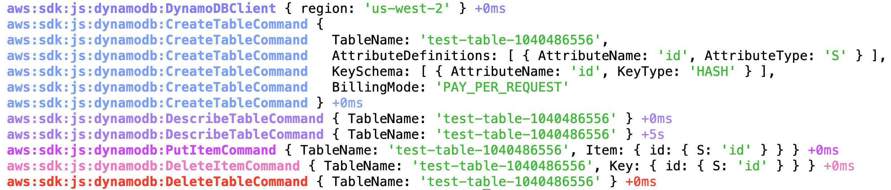

## Steps to follow

- [Configure your AWS credentials for Node.js](https://docs.aws.amazon.com/sdk-for-javascript/v2/developer-guide/setting-credentials-node.html)
- Run `DEBUG=aws:* node index.js` to log all debug statements

  <details>
  <summary>Screenshot</summary>

  

  </details>

- Run `DEBUG=aws:sdk:js:s3:PutObjectCommand node index.js` to log debug statements in PutObjectCommand

  <details>
  <summary>Screenshot</summary>

  

  </details>

- Get detailed output in ndjson format by [preloading pino-debug](https://github.com/pinojs/pino-debug#preload) while running the command

  <details>
  <summary>Output</summary>

  ```console
  $ DEBUG=aws:* node -r pino-debug index.js
  {"level":20,"time":1586383788192,"pid":75682,"hostname":"186590ce2139","ns":"aws:sdk:js:s3:S3Client","region":"us-west-2","v":1}
  {"level":20,"time":1586383788194,"pid":75682,"hostname":"186590ce2139","ns":"aws:sdk:js:s3:CreateBucketCommand","Bucket":"test-bucket-5429254215","v":1}
  {"level":20,"time":1586383789133,"pid":75682,"hostname":"186590ce2139","ns":"aws:sdk:js:s3:HeadBucketCommand","Bucket":"test-bucket-5429254215","v":1}
  {"level":20,"time":1586383789284,"pid":75682,"hostname":"186590ce2139","ns":"aws:sdk:js:s3:PutObjectCommand","Bucket":"test-bucket-5429254215","Key":"test-object","Body":"000000","v":1}
  {"level":20,"time":1586383789333,"pid":75682,"hostname":"186590ce2139","ns":"aws:sdk:js:s3:ListObjectsCommand","Bucket":"test-bucket-5429254215","v":1}
  {"level":20,"time":1586383789444,"pid":75682,"hostname":"186590ce2139","ns":"aws:sdk:js:s3:DeleteObjectCommand","Bucket":"test-bucket-5429254215","Key":"test-object","v":1}
  {"level":20,"time":1586383789474,"pid":75682,"hostname":"186590ce2139","ns":"aws:sdk:js:s3:DeleteBucketCommand","Bucket":"test-bucket-5429254215","v":1}
  ```

  </details>

- The ndjson formatted output can be made human readable by using transports like [pino-pretty](https://www.npmjs.com/package/pino-pretty)

  <details>
  <summary>Output</summary>

  ```console
  $ DEBUG=aws:* node -r pino-debug index.js | pino-pretty -t
  [2020-04-08 22:09:58.137 +0000] DEBUG (75692 on 186590ce2139):
      ns: "aws:sdk:js:s3:S3Client"
      region: "us-west-2"
  [2020-04-08 22:09:58.139 +0000] DEBUG (75692 on 186590ce2139):
      ns: "aws:sdk:js:s3:CreateBucketCommand"
      Bucket: "test-bucket-5004196652"
  [2020-04-08 22:09:58.998 +0000] DEBUG (75692 on 186590ce2139):
      ns: "aws:sdk:js:s3:HeadBucketCommand"
      Bucket: "test-bucket-5004196652"
  [2020-04-08 22:09:59.097 +0000] DEBUG (75692 on 186590ce2139):
      ns: "aws:sdk:js:s3:PutObjectCommand"
      Bucket: "test-bucket-5004196652"
      Key: "test-object"
      Body: "000000"
  [2020-04-08 22:09:59.146 +0000] DEBUG (75692 on 186590ce2139):
      ns: "aws:sdk:js:s3:ListObjectsCommand"
      Bucket: "test-bucket-5004196652"
  [2020-04-08 22:09:59.260 +0000] DEBUG (75692 on 186590ce2139):
      ns: "aws:sdk:js:s3:DeleteObjectCommand"
      Bucket: "test-bucket-5004196652"
      Key: "test-object"
  [2020-04-08 22:09:59.291 +0000] DEBUG (75692 on 186590ce2139):
      ns: "aws:sdk:js:s3:DeleteBucketCommand"
      Bucket: "test-bucket-5004196652"
  ```

  </details>

## Profiling

- Install [flamebearer](https://www.npmjs.com/package/flamebearer)
- Profile by running the following command:
  ```console
  $ DEBUG=aws:* node --prof index.js
  ```
- Generate HTML by running the following command:
  ```console
  $ node --prof-process --preprocess -j isolate*.log | flamebearer
  ```
- [An Example flamegraph](./flamegraph.html) - the debug module takes aroudn 3% of the time
